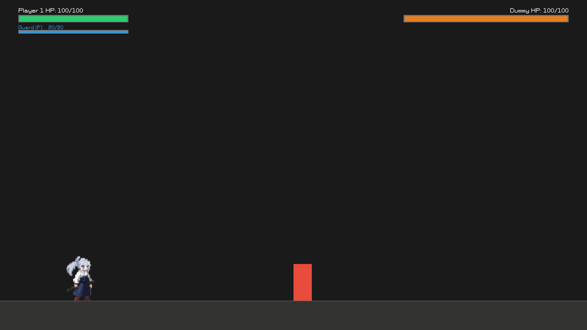
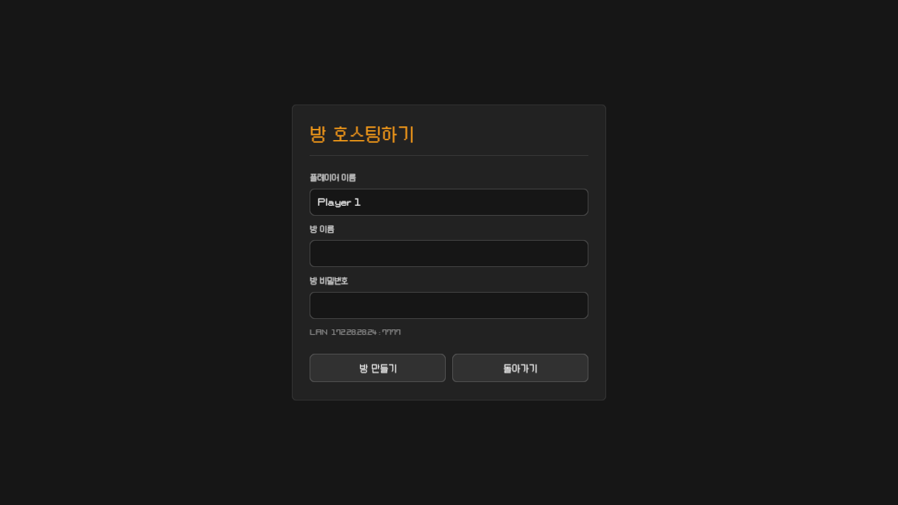
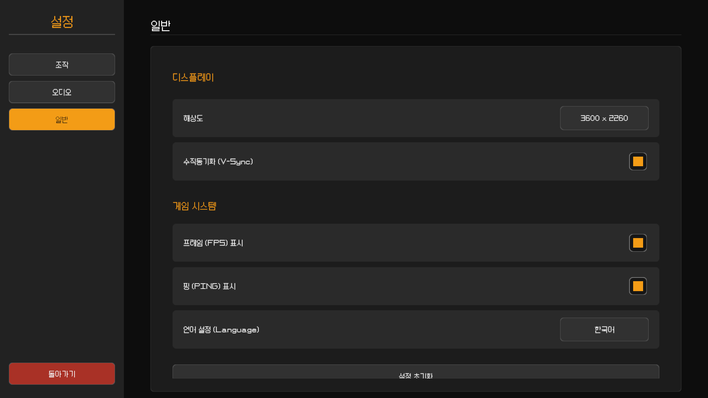

<h1 align="center">StarFlower::TeaTime</h1>

<p align="center">
  A 2D LAN fighting game in development with Unity.<br>
  Unity로 개발 중인 2D LAN 대전 격투 게임입니다.
</p>

<p align="center">
  <a href="#english">English</a> · <a href="#한국어">한국어</a>
</p>

<a id="english"></a>

## English

StarFlower::TeaTime is a 2D fighting game that brings the combat rules and interface of an existing React web game to Unity 6. It is designed for direct matches between Windows and macOS players on the same Wi-Fi or wired LAN.

### Screenshots

| Training mode | LAN room hosting |
| --- | --- |
|  |  |

<p align="center">
  
</p>

### Current Status

- Windows x64 is the planned Steam release target.
- macOS Universal is a private build for the developer and friends.
- Multiplayer currently uses direct connections on the same Wi-Fi/LAN.
- The interface supports Korean, English, and Japanese.
- The game runs in fullscreen and preserves the same 16:9 combat view at different display sizes.

Windows and macOS builds are available locally. A final cross-platform match between two physical computers still needs to be verified.

### Features

- Training mode and LAN one-on-one matches
- Room discovery, optional passwords, and direct IP connection
- Host-authoritative combat simulation
- Normal attacks, heavy attacks, grabs, guard, dash, double jump, and wall jump
- A 0.2-second perfect guard window and a condition-based ultimate
- Attack clashes resolved by attack type
- Grab escape with the ordered `W-A-S-D-W-A-S-D` command
- A synchronized three-second countdown after an online pause
- Rematches that require approval from both players
- Optional FPS and PING displays
- Resolution, VSync, audio, language, key binding, and reset settings
- Duplicate-key confirmation, unassigned actions, and invalid-key rejection

### Default Controls

| Action | Default input |
| --- | --- |
| Move and choose attack direction | `W`, `A`, `S`, `D` |
| Jump / double jump / wall jump | `Space` |
| Dash | `Left Shift` |
| Normal attack | Left mouse button |
| Heavy attack | Right mouse button |
| Guard | `F` |
| Grab / hold grab | `E` |
| Ultimate | `Q` |
| Pause / settings | `Escape` |
| Reset training | `R` |

Bindings can be changed under `Settings > Controls`. Only letters, numbers, `Left Shift`, `Space`, and the left/right mouse buttons can be assigned.

### Combat Rules

When two attacks connect on the same simulation tick, the following clash rules apply:

| Clash | Result |
| --- | --- |
| Normal vs normal | Both attacks are cancelled |
| Heavy vs heavy | Both attacks are cancelled and both fighters are pushed back |
| Grab vs grab | Both grabs are cancelled with a smaller pushback |
| Heavy vs normal | Heavy wins |
| Grab vs heavy | Grab wins |
| Normal vs grab | Normal wins |

A perfect guard occurs when guard is started within 0.2 seconds before an incoming hit connects. It prevents all health and guard-gauge damage.

The ultimate becomes available only when the following sequence is completed within two seconds of the first successful perfect guard:

1. Land four consecutive perfect guards.
2. Grab the opponent and throw them upward.
3. Hit the airborne opponent with a heavy attack while both fighters are airborne.
4. Press `Q` during the 1.5-second activation window.

The ultimate uses the same direction and hit range as a heavy attack, deals 20 damage, and grants a 5% movement-speed bonus for five seconds.

### Playing Over LAN

1. Connect both computers to the same Wi-Fi or wired LAN.
2. One player selects `Host Room` and creates a room.
3. The other player selects `Join Room` and chooses the discovered room.
4. If discovery fails, select direct IP entry and enter the host's IPv4 address.
5. After both players join, the host starts the match.

Gameplay uses UDP port `7777`, and room discovery uses UDP port `47777`. Allow StarFlower::TeaTime through the operating-system firewall for local-network access. Router AP/client isolation can prevent discovery and direct connections.

### Getting a Build

Executable builds are not committed to the source repository. Distribution ZIP files are provided through [GitHub Releases](https://github.com/love09pc/StarFlower-TeaTime/releases).

Windows players must download and extract the complete `StarFlower-TeaTime-Demo-v0.1.0-Windows-x64.zip`, then run `WebFight.exe`. Sending the EXE by itself will omit the Unity DLLs and data directory required to launch the game.

macOS players should download `StarFlower-TeaTime-Demo-v0.1.0-macOS-Universal.zip`, extract it, and open `StarFlower-TeaTime.app`. This demo build is ad-hoc signed but not Apple-notarized, so macOS may require Control-clicking the app and selecting `Open` on the first launch.

### Development

- Unity `6000.3.24f1`
- Universal Render Pipeline 2D `17.3.0`
- Unity Transport `2.6.0`
- Input System `1.20.0`
- Fixed simulation rate: `120 Hz`
- Network snapshot rate: `60 Hz`

Open [SampleScene](Assets/Scenes/SampleScene.unity) and enter Play mode. `WebFightBootstrap` creates the world and native Unity UI at runtime.

Platform builds can be created from the Unity menu:

- `Web Fight > Build > Windows x64 - Steam Target`
- `Web Fight > Build > macOS Universal - Private`

### Project Structure

```text
Assets/
  Editor/                    Build and verification tools
  Resources/WebGamePort/     Runtime font and character resources
  Scenes/                    Main Unity scene
  Scripts/WebGamePort/       Combat, UI, LAN, and settings code
  Settings/                  URP and Input System settings
docs/images/                 README screenshots
Packages/                    Unity package manifests
ProjectSettings/             Unity project settings
```

See [WEB_GAME_PORT.md](WEB_GAME_PORT.md) for detailed implementation notes and network verification results.

### Known Limitations

- Internet matchmaking, relay servers, and Steam invitations are not implemented.
- A final physical Windows-to-macOS LAN test is still required.
- BGM and sound-effect assets have not been added yet.
- Character animation and parts of the UI still use development assets.
- The Windows executable and a few internal files still use the `WebFight` development name.

---

<a id="한국어"></a>

## 한국어

StarFlower::TeaTime은 기존 React 웹 게임의 전투 규칙과 UI를 Unity 6으로 옮겨 개발 중인 2D 격투 게임입니다. 같은 Wi-Fi 또는 유선 LAN에서 Windows와 macOS 플레이어가 직접 대전하는 것을 목표로 합니다.

### 게임 화면

| 훈련장 | LAN 방 호스팅 |
| --- | --- |
|  |  |

<p align="center">
  
</p>

### 현재 상태

- Windows x64는 향후 Steam 배포 대상입니다.
- macOS Universal은 개발자와 지인용 비공개 배포 대상입니다.
- 멀티플레이는 현재 같은 Wi-Fi/LAN에서 직접 연결합니다.
- UI는 한국어, English, 日本語를 지원합니다.
- 전체화면으로 실행되며 화면 크기가 달라도 동일한 16:9 전투 시야를 유지합니다.

Windows와 macOS 빌드는 로컬에 생성되어 있습니다. 서로 다른 두 실제 컴퓨터를 이용한 최종 교차 플랫폼 대전은 아직 검증이 필요합니다.

### 주요 기능

- 훈련장과 LAN 1 대 1 대전
- 방 검색, 선택적 비밀번호, 직접 IP 연결
- 호스트 권한 기반 전투 판정
- 일반 공격, 강공격, 잡기, 가드, 대시, 이중 점프와 벽 점프
- 0.2초 퍼펙트 가드와 조건부 필살기
- 공격 종류에 따른 동시 공격 상쇄 판정
- `W-A-S-D-W-A-S-D` 순차 입력을 통한 잡기 탈출
- 온라인 일시정지 해제 후 동기화된 3초 카운트다운
- 양쪽 플레이어의 수락이 필요한 재대전
- 선택 가능한 FPS와 PING 표시
- 해상도, VSync, 오디오, 언어, 키 설정과 초기화
- 키 중복 확인, 지정 해제, 허용되지 않는 키 차단

### 기본 조작

| 행동 | 기본 입력 |
| --- | --- |
| 이동 및 공격 방향 | `W`, `A`, `S`, `D` |
| 점프 / 이중 점프 / 벽 점프 | `Space` |
| 대시 | `Left Shift` |
| 일반 공격 | 마우스 왼쪽 버튼 |
| 강공격 | 마우스 오른쪽 버튼 |
| 가드 | `F` |
| 잡기 / 잡기 유지 | `E` |
| 필살기 | `Q` |
| 일시정지 / 설정 | `Escape` |
| 훈련장 초기화 | `R` |

키 설정은 게임 내 `설정 > 조작`에서 변경할 수 있습니다. 알파벳, 숫자, `Left Shift`, `Space`, 마우스 왼쪽·오른쪽 버튼만 지정할 수 있습니다.

### 전투 규칙

동일한 시뮬레이션 틱에 두 공격이 적중하면 다음 우선순위를 적용합니다.

| 충돌 | 결과 |
| --- | --- |
| 일반 공격 vs 일반 공격 | 두 공격 상쇄 |
| 강공격 vs 강공격 | 상쇄 후 양쪽이 크게 밀려남 |
| 잡기 vs 잡기 | 상쇄 후 양쪽이 조금 밀려남 |
| 강공격 vs 일반 공격 | 강공격 승리 |
| 잡기 vs 강공격 | 잡기 승리 |
| 일반 공격 vs 잡기 | 일반 공격 승리 |

퍼펙트 가드는 상대 공격이 닿기 전 0.2초 안에 가드를 시작하면 발동합니다. 피해와 가드 게이지 손실을 모두 막습니다.

필살기는 첫 퍼펙트 가드 성공 후 2초 안에 다음 과정을 완료해야 사용할 수 있습니다.

1. 퍼펙트 가드 4회 연속 성공
2. 상대를 잡아 위로 던지기
3. 두 플레이어가 공중에 있는 동안 강공격 적중
4. 활성화된 1.5초 안에 `Q` 입력

필살기는 강공격과 같은 방향 및 범위를 사용하고 20 피해를 주며, 사용자는 5초 동안 이동 속도가 5% 증가합니다.

### LAN 대전 방법

1. 두 컴퓨터를 같은 Wi-Fi 또는 유선 LAN에 연결합니다.
2. 한 플레이어가 `방 호스팅하기`에서 방을 만듭니다.
3. 다른 플레이어가 `참여하기`에서 검색된 방을 선택합니다.
4. 방이 보이지 않으면 `IP 직접 입력`에 호스트의 IPv4 주소를 입력합니다.
5. 두 플레이어가 입장하면 호스트가 게임을 시작합니다.

게임 통신은 UDP `7777`, 방 검색은 UDP `47777`을 사용합니다. 운영체제 방화벽에서 StarFlower::TeaTime의 로컬 네트워크 통신을 허용해야 합니다. 공유기의 AP 격리 또는 클라이언트 격리가 켜져 있으면 방 검색과 직접 연결이 차단될 수 있습니다.

### 실행 파일 받기

실행 빌드는 소스 저장소에 직접 넣지 않습니다. 배포용 ZIP 파일은 [GitHub Releases](https://github.com/love09pc/StarFlower-TeaTime/releases)를 통해 제공합니다.

Windows 사용자는 `StarFlower-TeaTime-Demo-v0.1.0-Windows-x64.zip` 전체를 내려받아 압축을 풀고 `WebFight.exe`를 실행해야 합니다. EXE 파일만 따로 복사하면 Unity DLL과 데이터 폴더가 없어 실행되지 않습니다.

macOS 사용자는 `StarFlower-TeaTime-Demo-v0.1.0-macOS-Universal.zip`을 내려받아 압축을 풀고 `StarFlower-TeaTime.app`을 실행하면 됩니다. 이 데모는 임시 서명되어 있지만 Apple 공증을 받지는 않았으므로, 첫 실행 시 앱을 Control-클릭한 뒤 `열기`를 선택해야 할 수 있습니다.

### 개발 환경

- Unity `6000.3.24f1`
- Universal Render Pipeline 2D `17.3.0`
- Unity Transport `2.6.0`
- Input System `1.20.0`
- 기준 시뮬레이션: `120 Hz`
- 네트워크 스냅샷: `60 Hz`

[SampleScene](Assets/Scenes/SampleScene.unity)을 열고 Play를 누르면 됩니다. 게임 월드와 Unity UI는 `WebFightBootstrap`이 런타임에 생성합니다.

Unity 메뉴에서 플랫폼 빌드를 만들 수 있습니다.

- `Web Fight > Build > Windows x64 - Steam Target`
- `Web Fight > Build > macOS Universal - Private`

### 프로젝트 구조

```text
Assets/
  Editor/                    빌드 및 검증 도구
  Resources/WebGamePort/     런타임 폰트와 캐릭터 리소스
  Scenes/                    메인 Unity 씬
  Scripts/WebGamePort/       전투, UI, LAN, 설정 코드
  Settings/                  URP와 Input System 설정
docs/images/                 README용 게임 화면
Packages/                    Unity 패키지 목록
ProjectSettings/             Unity 프로젝트 설정
```

자세한 구현 기록과 네트워크 검증 내용은 [WEB_GAME_PORT.md](WEB_GAME_PORT.md)에서 확인할 수 있습니다.

### 알려진 제한 사항

- 인터넷 매치메이킹, 릴레이 서버, Steam 초대 기능은 아직 없습니다.
- 실제 Windows와 macOS 컴퓨터 사이의 최종 LAN 테스트가 필요합니다.
- BGM과 효과음 에셋은 아직 추가되지 않았습니다.
- 캐릭터 애니메이션과 일부 UI는 개발용 임시 리소스를 사용합니다.
- Windows 실행 파일과 일부 내부 파일에는 개발 중 사용한 `WebFight` 이름이 남아 있습니다.
